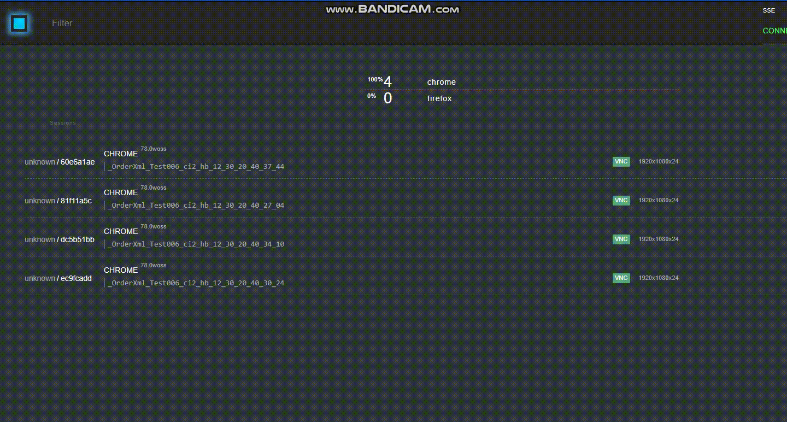

### Simple browser extension that allows you to force close Selenoid session with your stuck automation test

>Sometimes there is a need to force close Selenoid session. 
>This extension could help you with it.
```sh
Just right-click on the selected selenoid session and click on  'Close  Selenoid session'
```




### Install in Firefox:
>Open 'about:debugging#/runtime/this-firefox'  in your FF
>Click on 'Load Temporary Add-on'
>Select folder with manifest.json for Firefox


### Install in Chrome:
>Open 'chrome://extensions/'
>Check the box for Developer mode in the top right. 
>Click the Load unpacked extension button and select the unzipped folder for your extension to install it.


##### Tested on Firefox 72.0.1 and Chrome 79.0.3945.117  with  Selenoid 1.9.3 